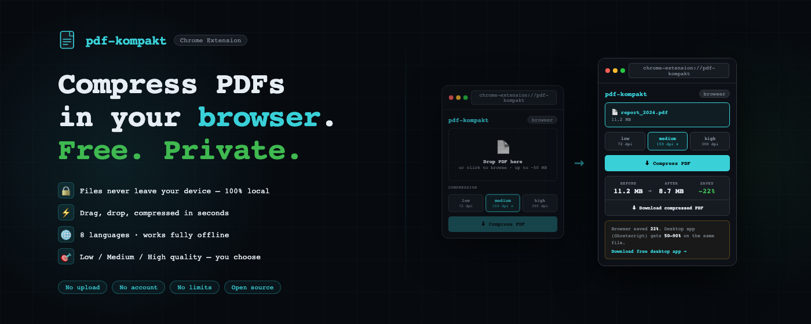
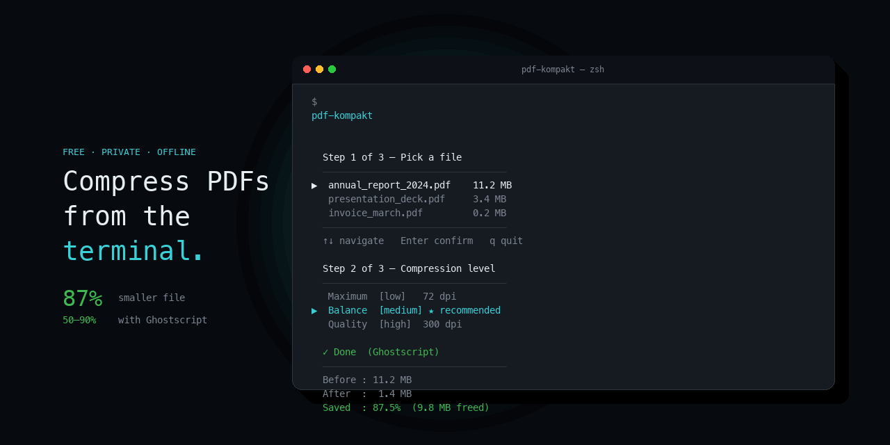

<p align="center">
  
</p>

<p align="center">
  <a href="https://kompakt.xronocode.com">🌐 Website</a> &nbsp;·&nbsp;
  <a href="https://github.com/xronocode/kompakt/releases/latest">⬇️ Download</a> &nbsp;·&nbsp;
  <a href="https://ko-fi.com/xronocode">☕ Ko-fi</a>
</p>

<p align="center">
  <strong>Free · Private · Offline · Open Source</strong>
</p>

---

## 💻 Desktop CLI



### Binary (no Python required)

Download the prebuilt binary for your platform from [Releases](https://github.com/xronocode/kompakt/releases/latest):

| Platform | File |
|----------|------|
| macOS    | `pdf-kompakt-macos` |
| Linux    | `pdf-kompakt-linux` |
| Windows  | `pdf-kompakt-windows.exe` |

```bash
# macOS / Linux
chmod +x pdf-kompakt-macos
./pdf-kompakt-macos
```

### Homebrew (macOS / Linux)

```bash
brew tap xronocode/tools
brew install pdf-kompakt
```

### Python (any platform)

Requires Python 3.8+.

```bash
git clone https://github.com/xronocode/kompakt.git
cd kompakt
pip install pypdf          # optional but recommended
python pdf_compress.py
```

For best compression, also install Ghostscript:

```bash
# macOS
brew install ghostscript

# Ubuntu / Debian
sudo apt install ghostscript

# Fedora
sudo dnf install ghostscript
```

## Usage

```
pdf-kompakt                              interactive: pick file + quality
pdf-kompakt input.pdf                    pick quality interactively
pdf-kompakt input.pdf -q medium          skip all menus
pdf-kompakt input.pdf -q low -o out.pdf  fully non-interactive
pdf-kompakt --methods                    check dependency status
pdf-kompakt --help
```

### Quality levels

| Flag | DPI | Compression | Best for |
|------|-----|-------------|----------|
| `low` | 72 | maximum | email, messaging, web |
| `medium` ★ | 150 | balanced | most use cases |
| `high` | 300 | minimal | print, archiving |

## How it works

Running `pdf-kompakt` opens a 3-step interactive wizard:

1. **Pick a file** — fuzzy search across all PDFs in the current directory, sort by name / date / size
2. **Choose quality** — low / medium / high with live hints
3. **Confirm output name** — sensible default, editable

```
  Step 2 of 3 — Choose compression level     (2/3)
  ────────────────────────────────────────────────────────
▶  Maximum compression  [low]
   Balance  [medium]  ★ recommended
   High quality  [high]
  ────────────────────────────────────────────────────────
  ℹ  72 dpi · heavy lossy · email, messengers, web
  ↑↓ navigate   Enter confirm   q quit

  ✓ Done  (Ghostscript)
  ────────────────────────────────────────────────────────
  Before : 11.2 MB
  After  : 1.4 MB
  Saved  : 87.5%  (9.8 MB freed)
```

## Dependencies

| Tool | Role | Install |
|------|------|---------|
| [Ghostscript](https://www.ghostscript.com/) | Primary engine · 50–90% savings | `brew install ghostscript` |
| [pypdf](https://pypdf.readthedocs.io/) | Fallback · 5–30% savings | `pip install pypdf` |

Both are optional — the tool detects what's available and offers to install missing ones on first run.

## Other products

- **[Chrome Extension](https://chromewebstore.google.com/detail/mdefmongjnjbapfanbfalhlgghihmmbo)** — compress PDFs in the browser (5–40%, up to 50 MB)
- **[Web Compress](https://kompakt.xronocode.com/compress)** — drag-and-drop compression on phone/desktop

*The desktop CLI with Ghostscript achieves 50–90% savings — the best compression for heavy PDFs.*

## License

MIT
